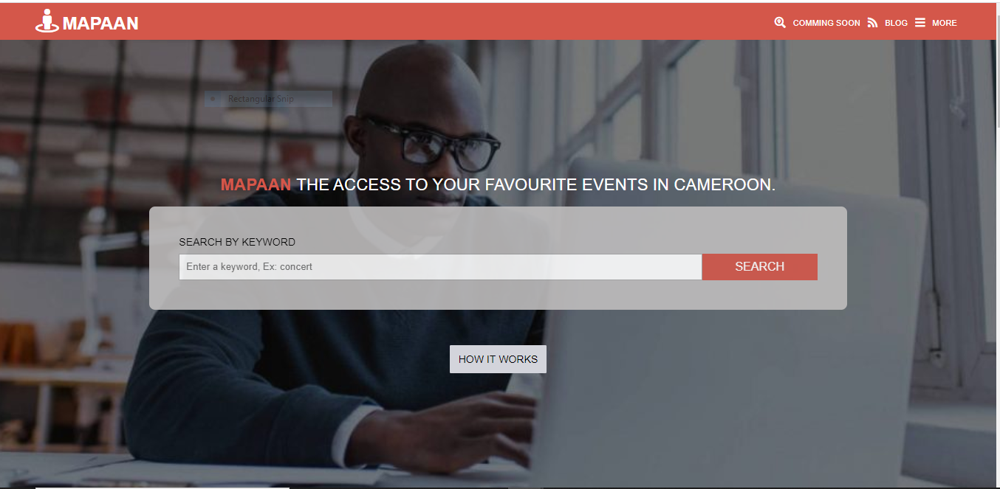
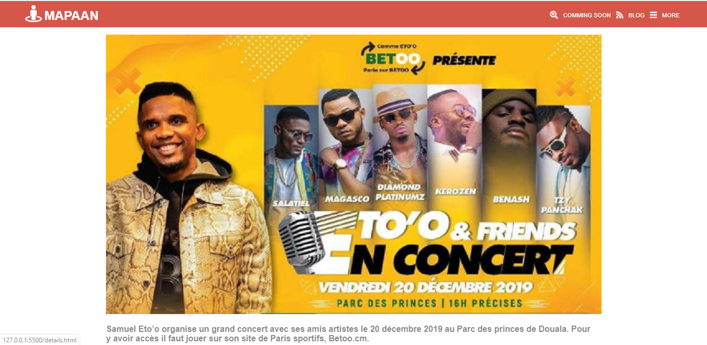

# Microverse-HTML-CSS-capstone-project
The final project for the first module, This a directory of social events that people can attend during the week.

> This is a practice case of Microverse HTML and CSS course. The goal is to clone the Newsweek homepage to implement responvive design with Boostrap.

Additional description about the project and its features.

## Built With

- HTML
- CSS
- BOOTSTRAP
- Visual Studio Code

## Live Demo

[Live Video]()

[Live Link](https://rawcdn.githack.com/EricMbouwe/Microverse-HTML-CSS-capstone-project/31fdafe8bd1d492b2f743aef6a0ea552b7bc52af/index.html)

## Getting Started

To get a local copy up and running follow these simple example steps.

### Prerequisites

- A compatible browser with HTML and CSS.

### Install

- Just fork/clone the project

### Usage

- Open the index.html file in any browser or edit using Visual Code or the preference IDE for web development

## Authors

👤 **Eric Mbouwe**

- Github: [@ericmbouwe](https://github.com/ericmbouwe)
- Twitter: [@ericmbouwe](https://twitter.com/ericmbouwe)
- Linkedin: [@ericmbouwe](https://www.linkedin.com/in/ericmbouwe/)

## 🤝 Contributing

Contributions, issues and feature requests are welcome! Start by:

* Forking the project
* Cloning the project to your local machine
* `cd` into the project directory
* Run `git checkout -b your-branch-name`
* Make your contributions
* Push your branch up to your forked repository
* Open a Pull Request with a detailed description to the development branch of the original project for a review

##### Please feel free to contribute to any of these!

Feel free to check the [issues page](https://github.com/EricMbouwe/Microverse-HTML-CSS-capstone-project/issues).

## Show your support

Give a ⭐️ if you like this project!

## Acknowledgments

- The Odin Project
- [LearnWebCode](https://www.youtube.com/channel/UCHRp19HU7Y2LwfI0Ai6WAGQ)
- [Microverse](microverse.org)

## 📝 License

This project is free to use as learning purposes.